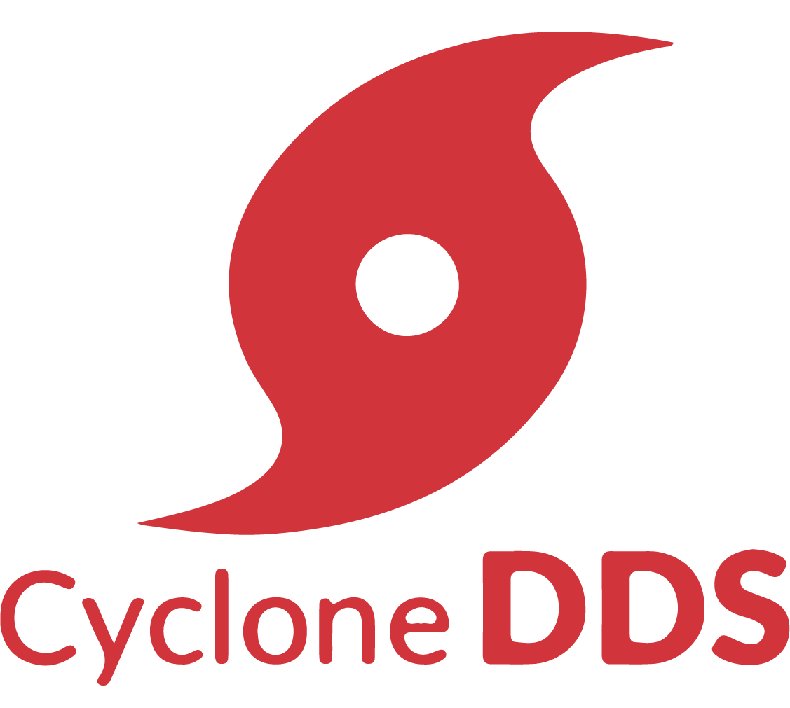

# CycloneDDS Getting Started

 

Eclipse Cyclone DDS is a very performant and robust OMG compliant Data Distribution Service (DDS) implementation. Cyclone DDS core is implemented in C and provides C-APIs to applications. Through its Cyclonedds-cxx package, the ISO/IEC C++ 2003 language binding is supported.

### Sections

**[Installing Eclipse Cyclone DDS](InstallCycloneDDS/index.md)**

To get started with Cyclone DDS, first install the Cyclone DDS.

**[Building Cyclone DDS applications](Build-app/index.md)**

This section will give you information on how to build an application using Cyclone DDS.

**[Hello World!, Code anatomy](Helloworld/index.md)**

This code anatomy will give you details about how to write an application using Cyclone DDS.

**[Benchmarking Tools for Cyclone](Benchmarking/index.md)**

This section gives information on how to measure data using the tool provided in Cyclone DDS.

**[Installing Eclipse Cyclone DDS – CXX](InstallCycloneDDS-CXX/index.md)**

To use Cyclone DDS in CXX, you can install the CXX bindings for Cyclone DDS.

**[Building Eclipse Cyclone DDS-CXX applications](Build-cxx-app/index.md)**

This section will give you information on how to build an application using Cyclone DDS with CXX bindings.

**[DDS-CXX Hello World Code anatomy](Helloworld-CXX/index.md)**

This code anatomy will give you details about how to write an application in CXX using Cyclone DDS CXX bindings.

**Appendices:**
- [Appendix I Contributing to Eclipse Cyclone DDS](Appendix/CycloneDDS-contribute/index.md)
- [Appendix II Contributing to Eclipse Cyclone DDS-CXX](Appendix/CycloneDDS-CXX-contribute/index.md)